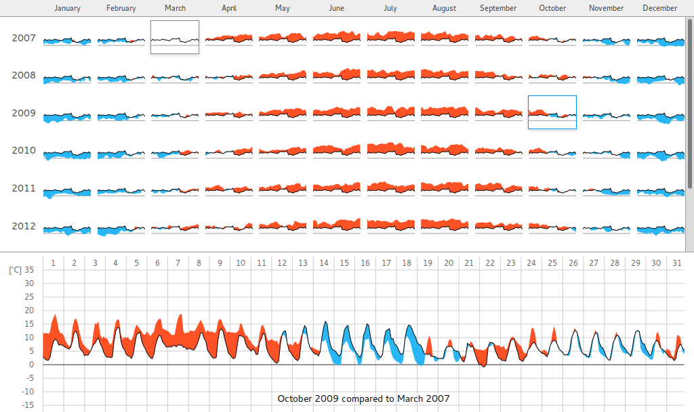

# thermostat

A high-density interactive visualization of temperatures across long time periods.

Built as part of my thesis "Interactive Visualization of Differences in Temperature Data Over Time".

## Data
The visualization is rendered client-side by React, using data from two json files: `data_2h.json` and `data_years_months_24h.json`. These files are generated from `data.json`, a single file containing all the data points, using `aggregate.js`.

To regenerate the two files from `data.json`, run `node aggregate.js data`, with `data` being the filename of the original file without a file extension.

## Setup
To get a local development setup, clone this repository and run `npm install` in the root directory. This will install all the necessary dependencies.

To compile the JSX, concatenate different files, watch for changes etc. you have to start Gulp. Just run the default task with `gulp`.

This gulp task doesn't include a local server, so you'll want to run an http server in a separate terminal. I use `live-server` (which you can install from npm: `npm install -g live-server`).
